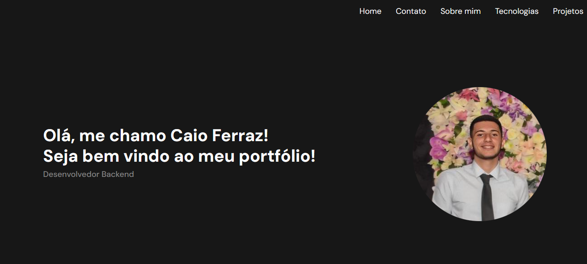

# Portfolio

Projeto de Portfolio web

## Stack utilizada

* HTML 5
* CSS 3
* Bootstrap
* JavaScript

## Referência

 - [Design de referência](https://www.figma.com/file/yGiUIAWP71S8saABm1bSRh/Portfolio-(Community)?type=design&node-id=0-1&mode=design&t=fKbAfRace5CA7ZKO-0)

 ## Feedback

Se você tiver algum feedback, por favor não deixe de dá-lo. 

Me contate através do [github](https://github.com/caiofrz) 
ou [LinkedIn](https://www.linkedin.com/in/caio-ferraz-almeida/) 